<!-- # HRMS MERN Application

Enterprise-level Human Resource Management System built using MERN Stack.

## Features

- Employee Management
- Attendance Management
- Leave Management
- Payroll System
- JWT Authentication
- Role Based Access
- Admin Dashboard

## Tech Stack

### Frontend
- React.js
- Axios
- Bootstrap / Tailwind CSS

### Backend
- Node.js
- Express.js
- MongoDB
- JWT Authentication

## Folder Structure

/hrms-dashboard -> React Frontend

/hrms-backend -> Node Backend

## Installation

### Backend

cd hrms-backend
npm install
npm start

### Frontend

cd hrms-dashboard
npm install
npm start

## Author

Dhiraj Hatwar -->


# 🚀 HRMS MERN Application

Enterprise-level Human Resource Management System built using the MERN Stack.
This application helps organizations manage employees, attendance, leave tracking, HR processes, onboarding, payroll-related documents, and administrative workflows efficiently.

---

# 📌 Features

* 🔐 Authentication & Authorization
* 👨‍💼 Employee Management
* 📝 Leave Tracking System
* ⏰ Attendance Management
* 📄 HR Letters Generation
* 🏦 PF / ESIC Management
* 🚪 Exit Process Management
* 📂 Employee File Management
* ✅ Task Management
* ⚙️ Global Settings & Configuration
* 📊 Dashboard Analytics

---

# 🛠️ Tech Stack

## Frontend

* React.js
* Redux Toolkit
* Tailwind CSS / CSS
* React Router DOM
* Axios

## Backend

* Node.js
* Express.js
* MongoDB
* JWT Authentication
* Mongoose

---

# 🔑 User Roles

* Admin
* HR
* Employee

Each user has different access permissions based on role-based authentication.

---

# 📷 Application Screenshots

## 🔐 Login 

```md
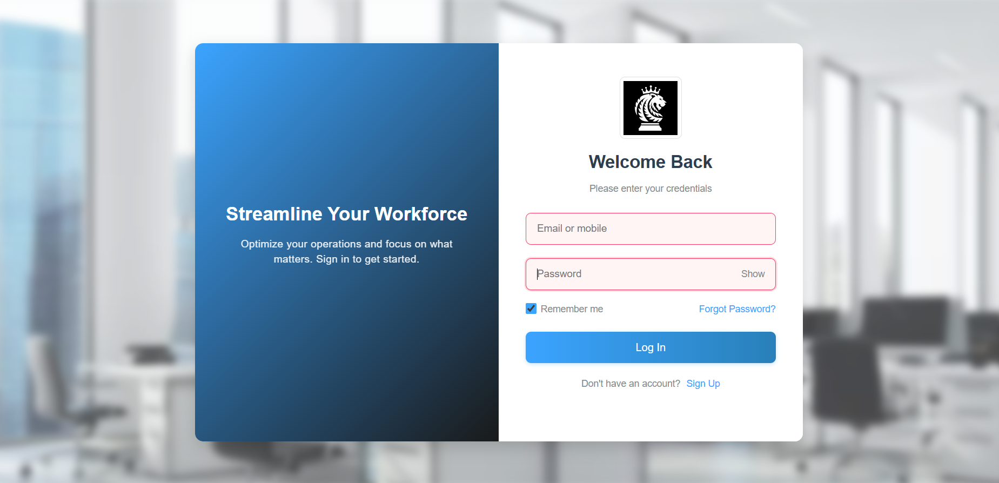
```
## 🔐 Signup 

```md
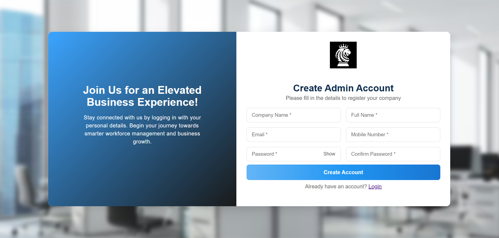
```

---

## 🏠 Home Dashboard

```md
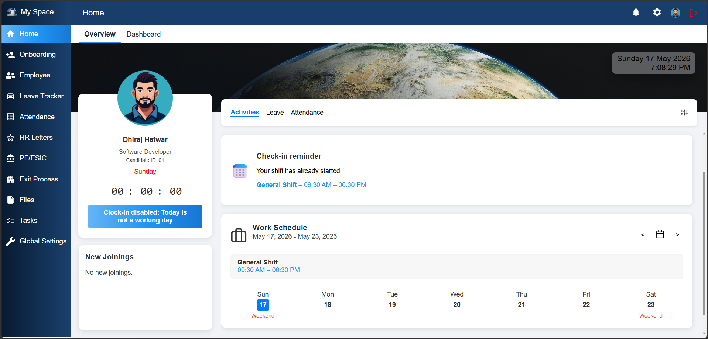
```

---

## 🚀 Employee Onboarding

```md
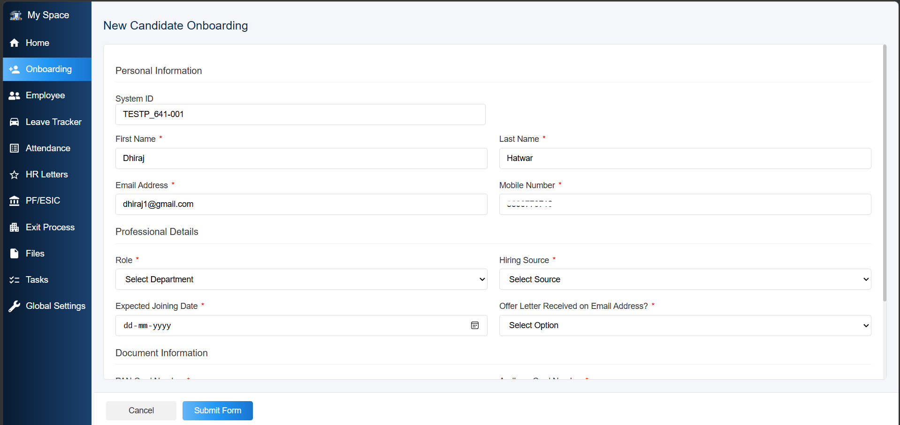
```

---

## 👨‍💼 Employee Management

```md
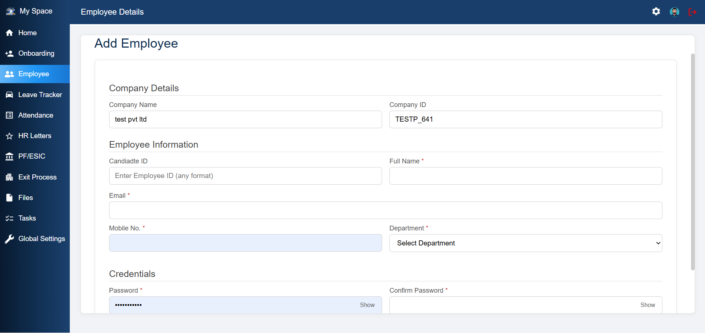
```

---

## 📝 Leave Tracker

```md
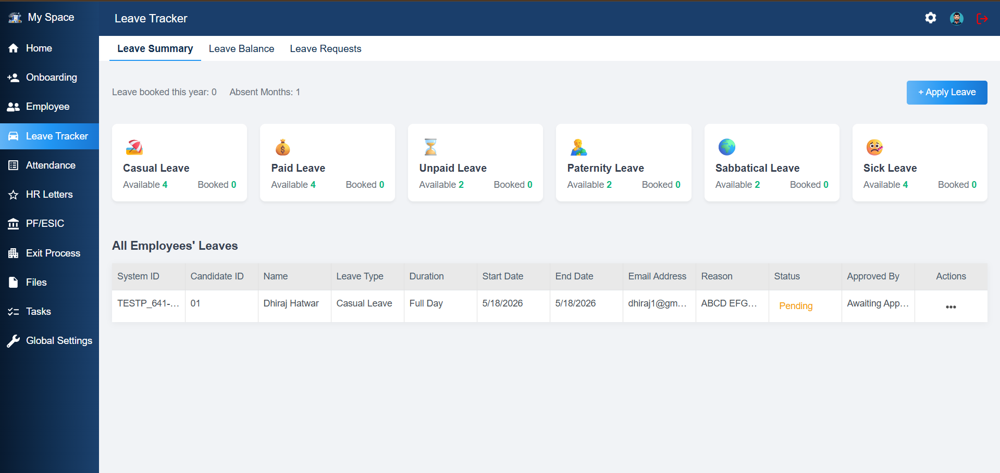
```

---

## ⏰ Attendance Management

```md
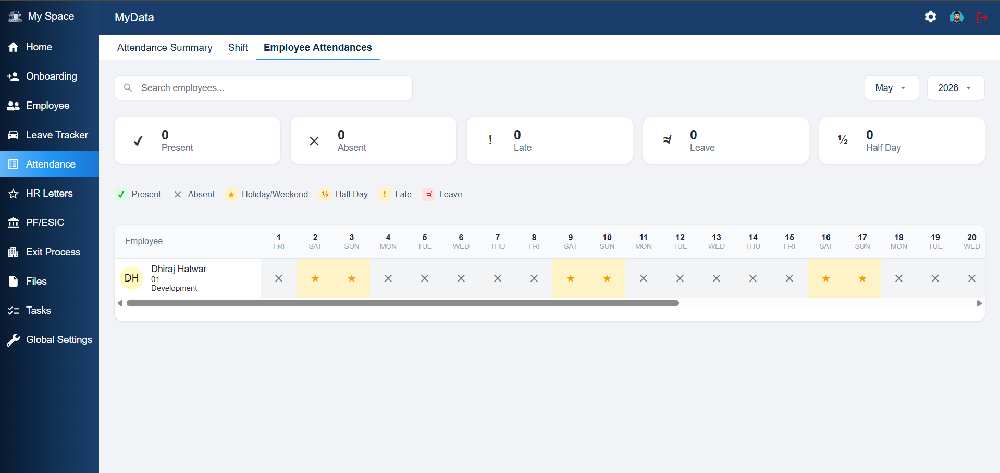
```

---

## 📄 HR Letters

```md
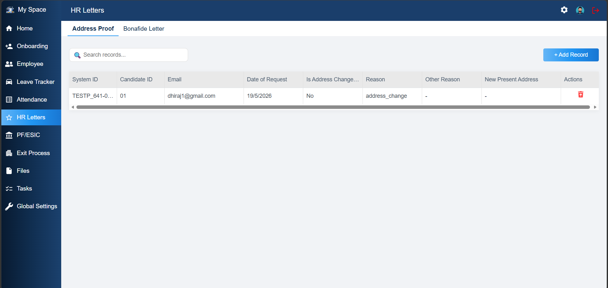
```

---

## 🏦 PF / ESIC Management

```md
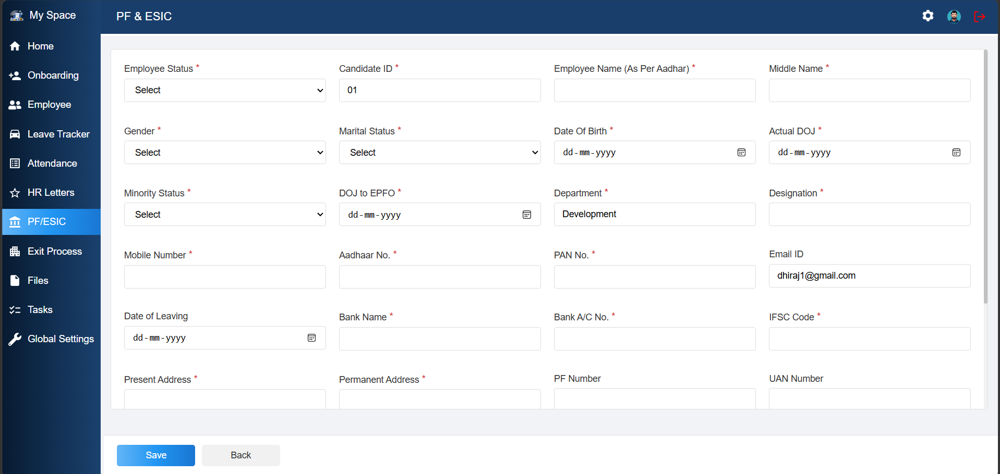
```

---

## 🚪 Exit Process

```md
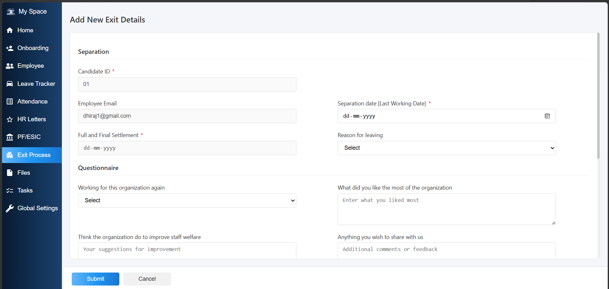
```


---

## ⚙️ Global Settings

```md
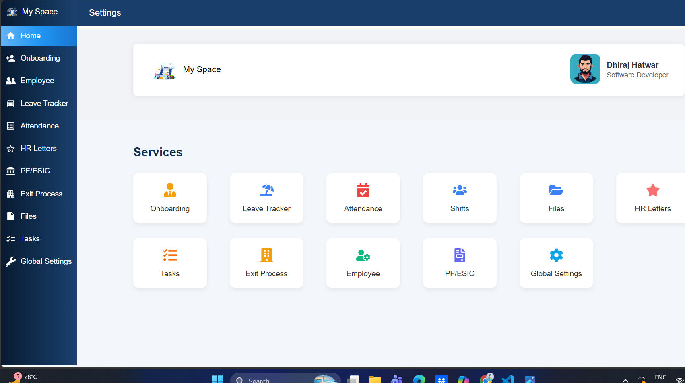
```

---

# ⚙️ Installation & Setup

## Clone Repository

```bash
git clone https://github.com/your-username/hrms-project.git
```

## Install Frontend Dependencies

```bash
cd client
npm install
```

## Install Backend Dependencies

```bash
cd server
npm install
```

## Run Frontend

```bash
npm start
```

## Run Backend

```bash
npm run server
```

---

# 🔐 Environment Variables

Create `.env` file inside server folder.

```env
PORT=5000
MONGO_URI=your_mongodb_connection
JWT_SECRET=your_secret_key
```

---

# 📈 Project Highlights

* Enterprise-level architecture
* Secure JWT Authentication
* Role-Based Access Control
* Responsive UI Design
* Real-world HR workflow implementation
* REST API Integration

---

# 👨‍💻 Developer

**Dhiraj Hatwar**

* MERN Stack Developer
* Full Stack Web Developer

---

# ⭐ Support

If you like this project, give it a ⭐ on GitHub.
